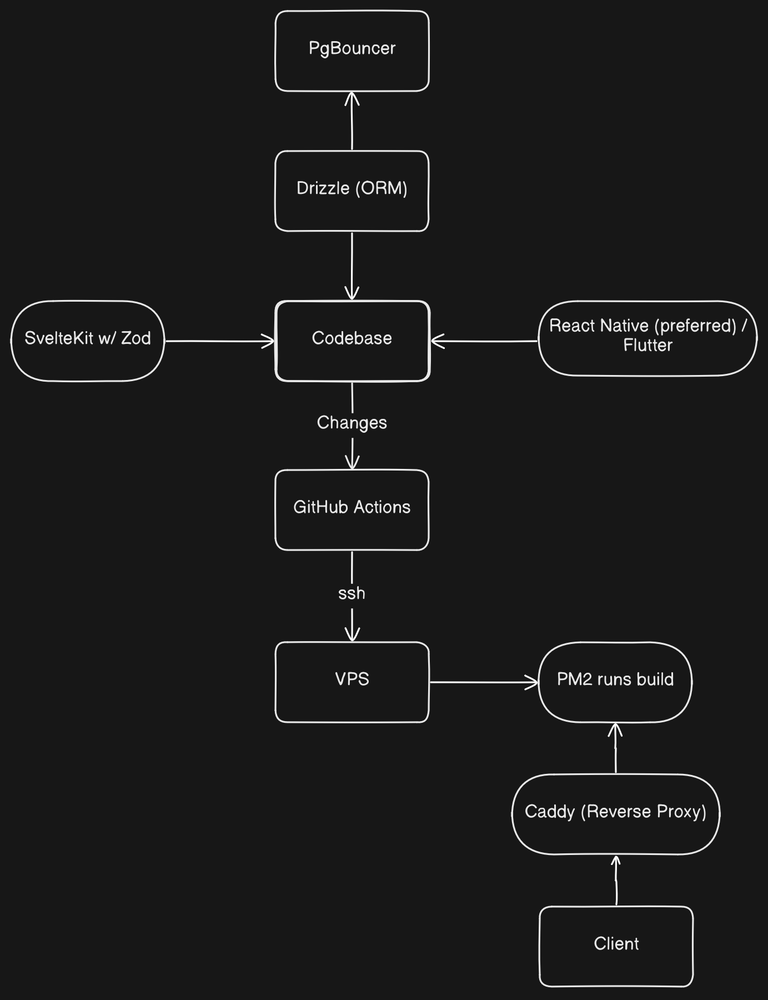

# Ideal-Development-Model

## 1. SvelteKit Config

> [Install](https://bun.com/docs/installation) `bun` and refer SvelteKit [docs](https://svelte.dev/docs/kit/introduction)

Create your _SvelteKit_ project using `bunx sv create my-app` and choose `drizzle` package

```typescript
// svelte.config.js
import adapter from "@sveltejs/adapter-node";
import { vitePreprocess } from "@sveltejs/vite-plugin-svelte";

export default {
    preprocess: vitePreprocess(),
    kit: {
        adapter: adapter({
            out: "build",
        }),
    },
};
```

---

## 2. PM2 Ecosystem File

```javascript
// ecosystem.config.cjs
module.exports = {
    apps: [
        {
            name: "my-app",
            script: "build/index.js",
            interpreter: "bun",
            instances: 1,
            autorestart: true,
            watch: false,
            env_production: {
                NODE_ENV: "production",
                PORT: 3000,
            },
        },
    ],
};
```

---

## 3. Drizzle Migration Script

```typescript
// scripts/migrate.ts
import { drizzle } from "drizzle-orm/postgres-js";
import { migrate } from "drizzle-orm/postgres-js/migrator";
import postgres from "postgres";

const client = postgres(process.env.DATABASE_URL!, { max: 1 });
const db = drizzle(client);

await migrate(db, { migrationsFolder: "./drizzle" });
await client.end();

console.log("Migrations complete");
```

---

## 4. PgBouncer Config

On your VPS at `/etc/pgbouncer/pgbouncer.ini`:

```ini name=pgbouncer.ini
[databases]
mydb = host=127.0.0.1 port=5432 dbname=mydb

[pgbouncer]
listen_port = 6432
listen_addr = 127.0.0.1
auth_type = scram-sha-256
auth_file = /etc/pgbouncer/userlist.txt
pool_mode = transaction        ; best for SvelteKit's request-scoped connections
max_client_conn = 100
default_pool_size = 20
server_reset_query = DISCARD ALL
```

Your `DATABASE_URL` in `.env` on the VPS points to PgBouncer, not Postgres directly:

> Set `prepare: false` in your Drizzle postgres client.

```typescript
// src/lib/db.ts
import { drizzle } from "drizzle-orm/postgres-js";
import postgres from "postgres";

const client = postgres(process.env.DATABASE_URL!, {
    prepare: false, // required for pgbouncer transaction mode
});

export const db = drizzle(client);
```

---

## 5. Caddyfile

On your VPS at `/etc/caddy/Caddyfile`:

```caddy name=Caddyfile
yourdomain.com {
    reverse_proxy localhost:3000
}
```

---

## 6. GitHub Actions Workflow

> Create a [repo](https://github.com/orgs/Maestrominds/repositories) in GitHub **Maestrominds** org

```yaml
# .github/workflows/deploy.yml
name: Deploy

on:
    push:
        branches: [main]

jobs:
    deploy:
        runs-on: ubuntu-latest

        steps:
            - name: Deploy to VPS
              uses: appleboy/ssh-action@v1.0.3
              with:
                  host: ${{ secrets.VPS_HOST }}
                  username: ${{ secrets.VPS_USER }}
                  key: ${{ secrets.VPS_SSH_KEY }}
                  script: |
                      set -e

                      cd /var/www/my-app

                      echo "--- Pulling latest code ---"
                      git pull origin main

                      echo "--- Installing dependencies ---"
                      bun install --frozen-lockfile

                      echo "--- Running migrations ---"
                      bun run scripts/migrate.ts

                      echo "--- Building ---"
                      bun run build

                      echo "--- Restarting app ---"
                      pm2 restart ecosystem.config.cjs --env production

                      echo "--- Done ---"
```

---

## 7. GitHub Secrets to Set

Go to **Repo → Settings → Secrets and variables → Actions** and add:

| Secret        | Value                                |
| ------------- | ------------------------------------ |
| `VPS_HOST`    | Your VPS IP or domain                |
| `VPS_USER`    | SSH username (e.g. `ubuntu`)         |
| `VPS_SSH_KEY` | Contents of your **private** SSH key |

---

## 8. First-Time VPS Setup (run once manually)

```bash name=vps-setup.sh
# Install bun
curl -fsSL https://bun.sh/install | bash

# Install pm2 globally
bun add -g pm2
pm2 startup  # follow the output instructions to enable on reboot

# Install caddy (Debian/Ubuntu)
sudo apt install -y debian-keyring debian-archive-keyring apt-transport-https
curl -1sLf 'https://dl.cloudsmith.io/public/caddy/stable/gpg.key' | sudo gpg --dearmor -o /usr/share/keyrings/caddy-stable-archive-keyring.gpg
curl -1sLf 'https://dl.cloudsmith.io/public/caddy/stable/debian.deb.txt' | sudo tee /etc/apt/sources.list.d/caddy-stable.list
sudo apt update && sudo apt install caddy

# Install pgbouncer
sudo apt install -y pgbouncer

# Clone your repo
git clone git@github.com:youruser/your-repo.git /var/www/my-app

# Create .env on the VPS (fill in your secrets)
nano /var/www/my-app/.env

# First manual deploy
cd /var/www/my-app
bun install
bun run scripts/migrate.ts
bun run build
pm2 start ecosystem.config.cjs --env production
pm2 save
```

---

## 9. OpenAPI

Use `zod-openapi` npm package to setup OpenAPI specs.

```typescript
// src/lib/server/openapi.ts
import { createDocument } from "zod-openapi";
import {
    PostSchema,
    CreatePostSchema,
    UpdatePostSchema,
} from "../../schemas/posts";

export const spec = createDocument({
    openapi: "3.1.0",
    info: { title: "My API", version: "1.0.0" },
    servers: [{ url: "https://yourdomain.com" }],
    paths: {
        "/api/posts/{id}": {
            get: {
                summary: "Get post by ID",
                parameters: [
                    {
                        name: "id",
                        in: "path",
                        required: true,
                        schema: z.number().openapi({ example: 1 }),
                    },
                ],
                responses: {
                    200: {
                        description: "A post",
                        content: {
                            "application/json": {
                                schema: PostSchema,
                            },
                        },
                    },
                    404: { description: "Post not found" },
                },
            },
            patch: {
                summary: "Update a post",
                requestBody: {
                    content: {
                        "application/json": {
                            schema: UpdatePostSchema,
                        },
                    },
                },
                responses: {
                    200: {
                        description: "Updated post",
                        content: {
                            "application/json": {
                                schema: PostSchema,
                            },
                        },
                    },
                },
            },
        },
    },
});
```

Serve it as static JSON

```typescript
// src/routes/api/openapi.json/+server.ts
import { json } from "@sveltejs/kit";
import { spec } from "$lib/server/openapi";

export const GET = async () => json(spec);
```

---

## 10. Model



---

## 11. Reasons for suggestion

- **Better** DX and **Agile**
- **Simpler** CI/CD
- **Low** latency and **Scalable**
- React Native supports **OTA**

---
